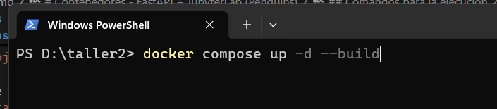
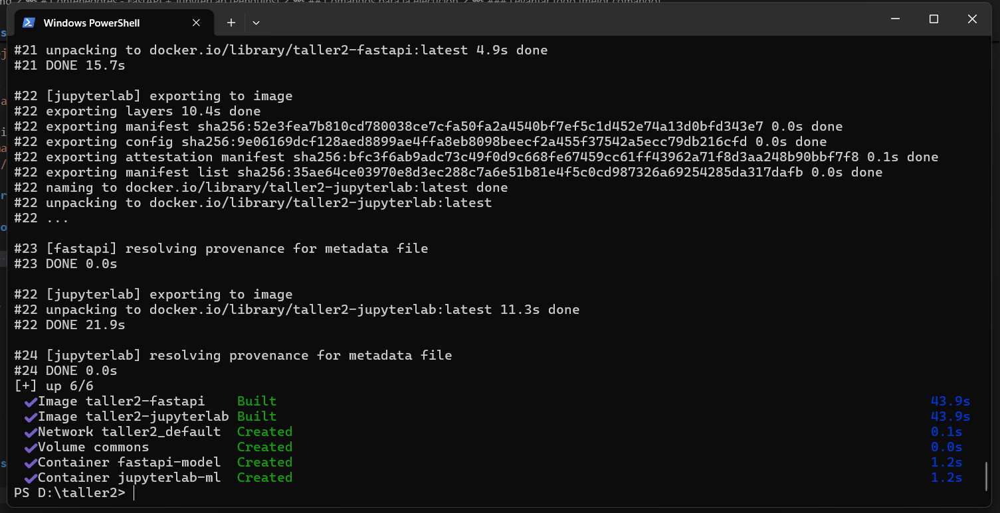
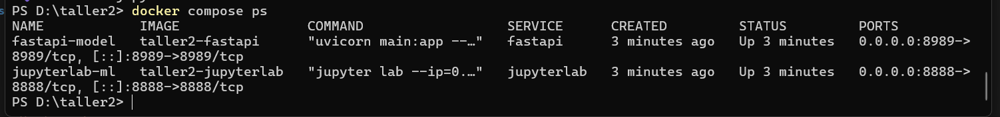
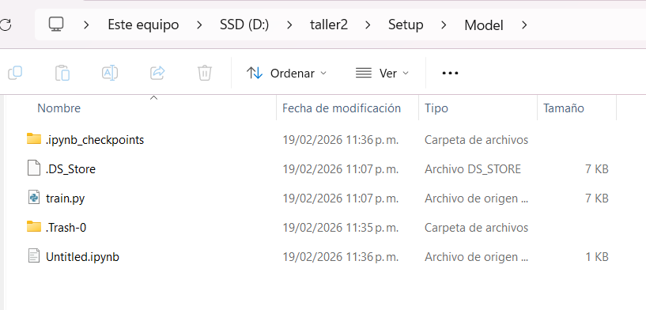
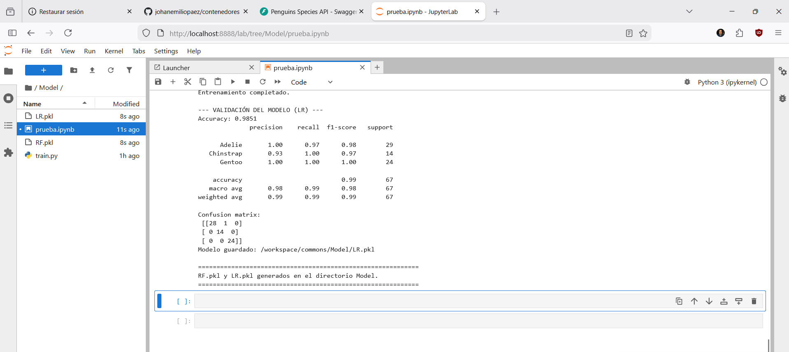
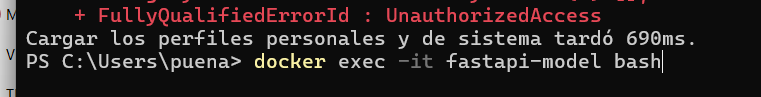
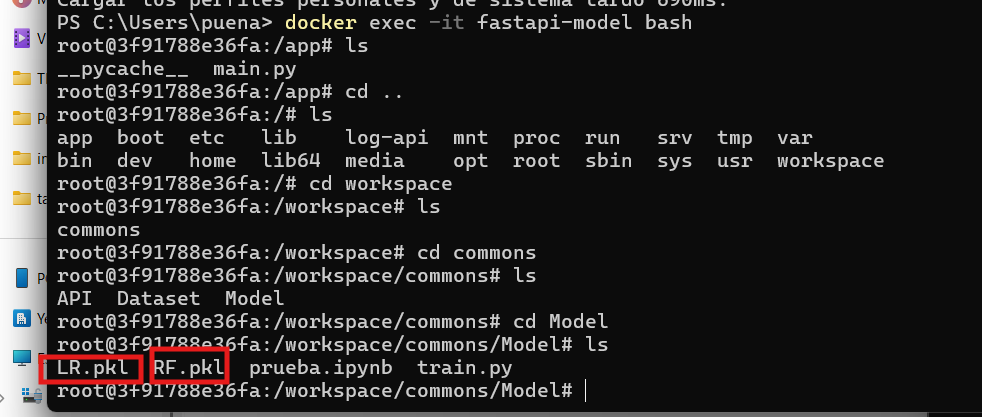
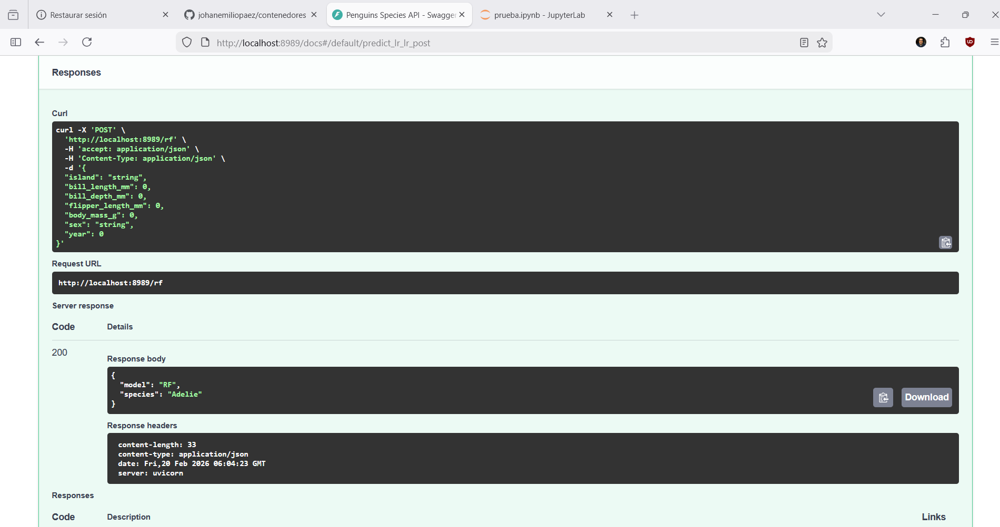
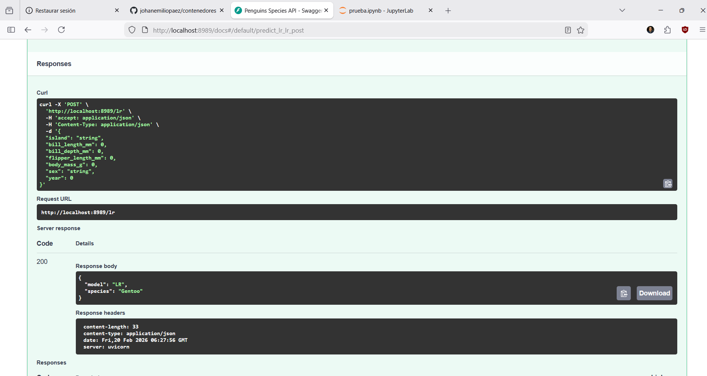

# Contenedores - FastAPI + JupyterLab (Penguins)

Entorno de desarrollo para:
- entrenar modelos en `JupyterLab`,
- exponer inferencia en `FastAPI`,
- compartir artefactos y datos por el volumen `commons`.

Las dependencias se gestionan con **UV** usando `Setup/pyproject.toml`.

## Estructura del proyecto

```
contenedores/
├── Docker/
│   ├── fastapi.Dockerfile
│   └── jupyterlab.Dockerfile
├── Setup/
│   ├── API/
│   │   └── main.py
│   ├── Model/
│   │   ├── train.py
│   │   └── train_step_by_step.ipynb
│   ├── Dataset/
│   │   └── penguins.csv
│   └── pyproject.toml
├── docker-compose.yml
└── .dockerignore
```

## Servicios

### FastAPI (`fastapi-model`)
- Puerto: `8989`
- App: `Setup/API/main.py`
- Ejecuta con hot-reload (`uvicorn --reload`) para reflejar cambios en `main.py` sin rebuild.

### JupyterLab (`jupyterlab-ml`)
- Puerto: `8888`
- Arranque sin autenticacion:
  - `--ServerApp.token=`
  - `--ServerApp.password=`

## Volumen compartido `commons`

Los dos contenedores montan `commons` en `/workspace/commons`.

En este proyecto, **`Setup/` contiene exactamente los directorios que van al volumen `commons`**:
- `Setup/API`
- `Setup/Model`
- `Setup/Dataset`

Estos directorios se montan asi:

- `./Setup/API` -> `/workspace/commons/API`
- `./Setup/Model` -> `/workspace/commons/Model`
- `./Setup/Dataset` -> `/workspace/commons/Dataset`

En `fastapi` tambien se monta:
- `./Setup/API` -> `/app` (necesario para hot-reload).

## Dependencias con UV

Archivo fuente de dependencias:
- `Setup/pyproject.toml`

Ese archivo se instala en ambos Dockerfiles con:
- `uv pip install --system -r /tmp/pyproject.toml`

Incluye librerias requeridas por:
- `Setup/API/main.py`
- `Setup/Model/train.py`

## Comandos para la ejecucion

### Levantar todo (mejor comando)

```bash
docker compose up -d --build
```

### Ver estado

```bash
docker compose ps
```

### Ver logs
```bash
docker compose logs -f
```

### Reiniciar solo FastAPI
```bash
docker compose up -d --build fastapi
```

### Detener servicios
```bash
docker compose down
```

## URLs

- FastAPI: `http://localhost:8989`
- FastAPI docs: `http://localhost:8989/docs`
- JupyterLab: `http://localhost:8888`

## Flujo de trabajo (JupyterLab -> FastAPI)

1. Entrena o actualiza modelos en JupyterLab y guarda `.pkl` en `Setup/Model/`.







2. Si agregas un modelo nuevo (ej. `NN.pkl`), actualiza `Setup/API/main.py` con su ruta/endpoint.
3. FastAPI recarga automaticamente al guardar `main.py` por `--reload`.

Nota: si cambias solo un `.pkl` sin cambiar codigo, la API usara el archivo nuevo segun la logica de carga definida en `main.py`.
